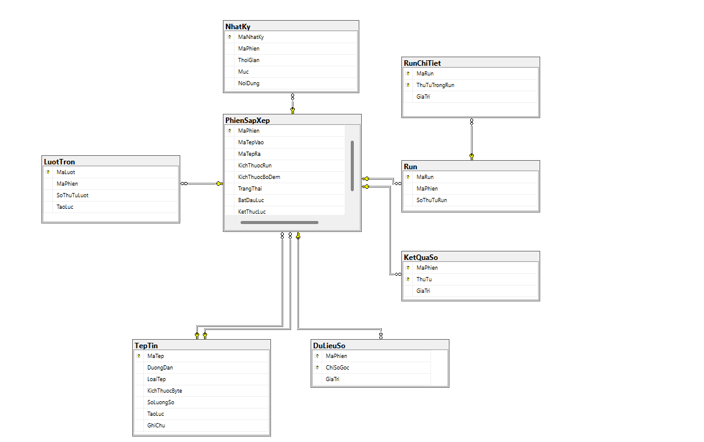
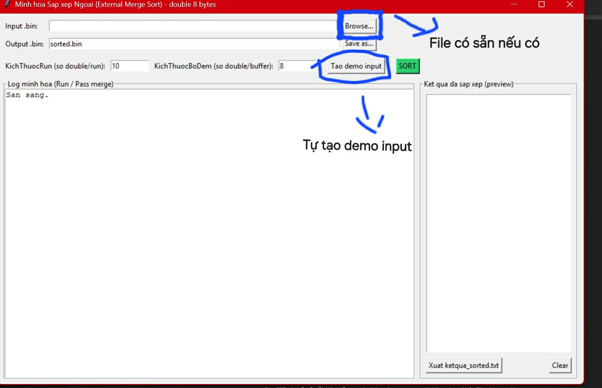
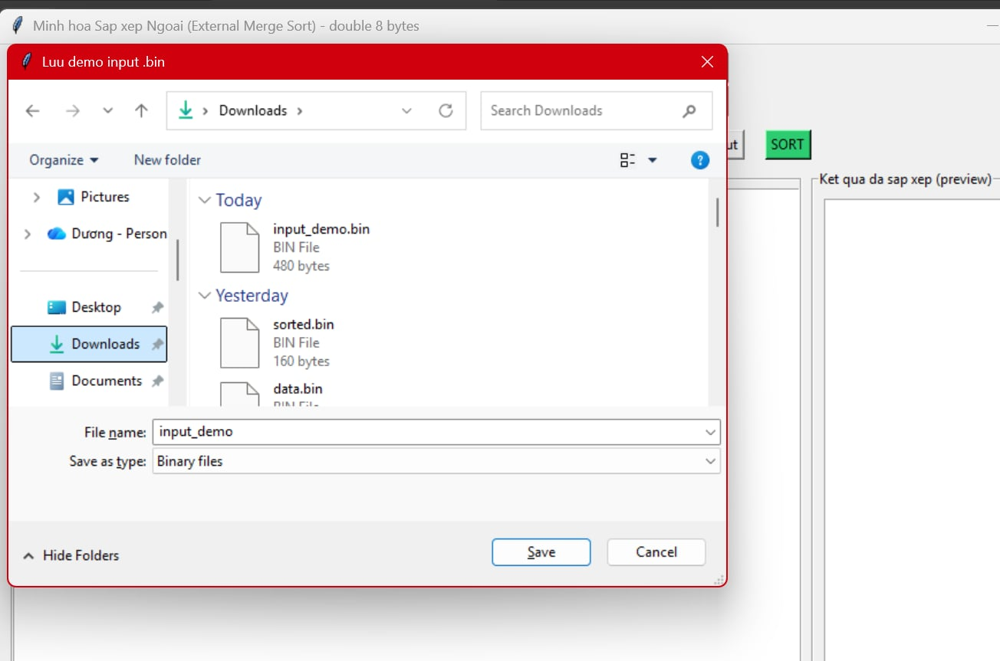
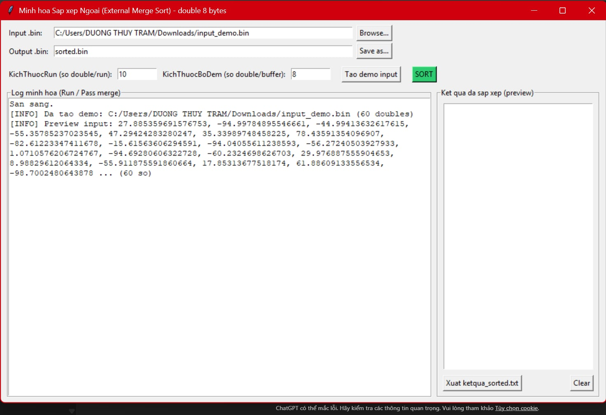
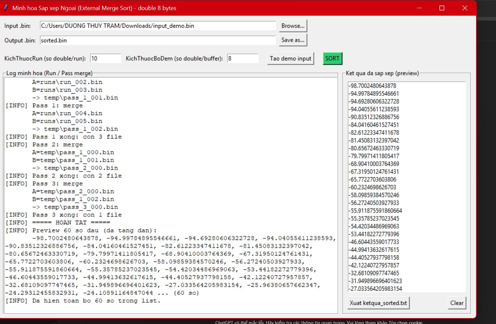
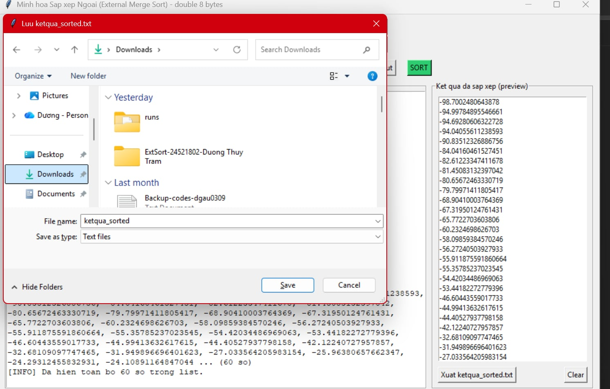
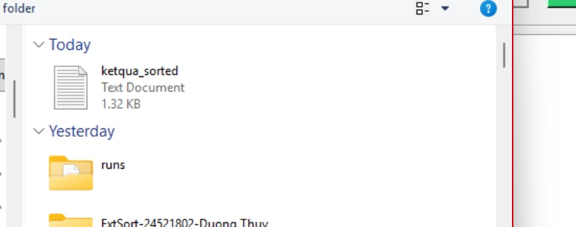

# DuongThuyTram-24521802-ExtSort
# 🗂️ Ứng dụng minh hoạ Sắp xếp Ngoại (External Merge Sort)

> Xây dựng ứng dụng cho phép người dùng chọn lựa tập tin dữ liệu nguồn và sắp xếp dữ liệu trong tập tin này tăng dần. 

Tập tin lưu dữ liệu là các số thực (8bytes) ở dạng tập tin nhị phân

Chương trình cần minh họa quá trình sắp xếp với các tập tin có kích thước nhỏ.

---

## 📌 Table of Contents
- [Introduction](#introduction)
- [Database](#database)
- [Features](#features)
  - [Major Features](#major-features)
  - [Minor Features](#minor-features)
- [How to run](#how-to-run)
- [Author](#author)

---

## Introduction
Em tên: **<Dương Thùy Trâm>** , MSSV **<24521802>**, lớp **<CS523.Q21>**.

Sau đây là bảng mô tả cách xây dựng ứng dụng minh hoạ sắp xếp ngoại
- Input: tệp `.bin` chứa các số thực `double` (8 bytes) dạng nhị phân
- Output: tệp `.bin` đã được sắp xếp tăng dần
- Minh hoạ: tạo các run nhỏ (sort trong RAM) và trộn nhiều lượt (pass merge)

---

## Database
Phần database (ERD) dùng để mô tả các “thành phần” trong quá trình sắp xếp ngoại và mối quan hệ giữa chúng, ví dụ: một phiên sắp xếp sẽ tạo ra nhiều run, mỗi lượt trộn sẽ ghép các run lại, cuối cùng sinh ra tệp kết quả đã sắp xếp.



---

## Features

### Major Features
1. Chọn file input `.bin` (double 8 bytes) nếu có sẵn
2. Chỉnh sửa cấu hình tham số với  `KichThuocRun` và `KichThuocBoDem`
3. Dùng thuật toán sắp xếp ngoại (External Merge Sort) để sắp xếp
4. Hiển thị log minh hoạ: tạo run + merge pass
5. Hiển thị kết quả: `sorted.bin` và `ketqua_sorted.txt`

### Minor Features
1. Cho phép người dùng tạo demo input nhanh (random doubles) nếu không có dữ liệu sẵn 
2. Hiển thị kết quả đã sắp xếp trên giao diện

---

## How to run
1. Có hai cách để đưa dữ liệu vào :
- Chọn file có sẵn nếu có
- Có thể demo input nhanh
- 

2. Chọn nơi lưu output
\
3.Bấm SORT

4 Xuất kết quả ra file txt để xem hết




---

## Installation
Yêu cầu:
- Python 3.9+ (hoặc 3.10+)
- Tkinter (Windows thường có sẵn)

Cài đặt (nếu cần):
```bash
python --version
